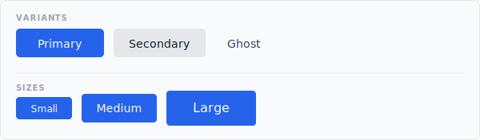
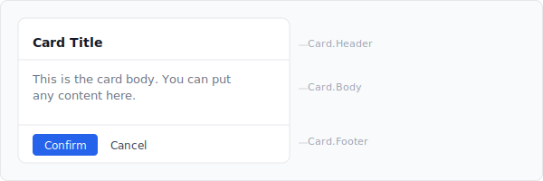
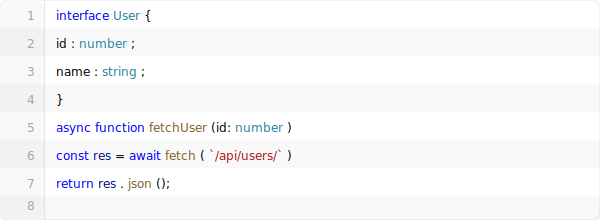
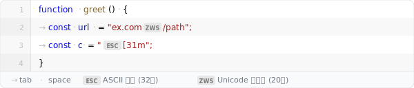

# plastic

TypeScript + React 기반 UI 컴포넌트 라이브러리.

**[데모 보기 →](https://pihitpihit.github.io/plastic/)**

---

## Installation

```bash
npm install plastic
```

> **참고** — plastic 컴포넌트는 Tailwind CSS 클래스를 사용합니다.  
> 프로젝트의 `tailwind.config.js` `content` 배열에 아래 경로를 추가하세요.
>
> ```js
> content: [
>   "./src/**/*.{ts,tsx}",
>   "./node_modules/plastic/dist/**/*.js", // plastic 컴포넌트 클래스 스캔
> ]
> ```

---

## Quick Start

```ts
import { Button, Card, CodeView } from "plastic";
import type { ButtonProps, CardRootProps, CodeViewProps } from "plastic";
```

모든 컴포넌트와 타입은 `"plastic"` 단일 진입점에서 import합니다.

---

## Components

### Button

클릭 가능한 기본 버튼 컴포넌트. `HTMLButtonElement`의 모든 속성(`onClick`, `type`, `aria-*` 등)을 그대로 사용할 수 있습니다.



#### Props

| Prop | Type | Default | Description |
|---|---|---|---|
| `variant` | `"primary" \| "secondary" \| "ghost"` | `"primary"` | 버튼 스타일 |
| `size` | `"sm" \| "md" \| "lg"` | `"md"` | 버튼 크기 |
| `loading` | `boolean` | `false` | 로딩 상태 (자동으로 `disabled` 처리) |
| `disabled` | `boolean` | `false` | 비활성화 |
| `children` | `ReactNode` | 필수 | 버튼 내용 |

#### Usage

```tsx
import { Button } from "plastic";

// Variants
<Button variant="primary">Primary</Button>
<Button variant="secondary">Secondary</Button>
<Button variant="ghost">Ghost</Button>

// Sizes
<Button size="sm">Small</Button>
<Button size="md">Medium</Button>
<Button size="lg">Large</Button>

// States
<Button disabled>Disabled</Button>
<Button loading>Loading...</Button>

// HTML 속성 그대로 사용
<Button type="submit" onClick={() => console.log("clicked")}>
  Submit
</Button>
```

---

### Card

Compound 컴포넌트 패턴의 카드. `Card.Root`, `Card.Header`, `Card.Body`, `Card.Footer`를 조합해서 사용합니다. 서브 컴포넌트는 필요한 것만 선택적으로 사용할 수 있습니다.



#### Sub-components

| Component | Description |
|---|---|
| `Card.Root` | 카드 외곽 컨테이너 (필수) |
| `Card.Header` | 상단 제목 영역 (선택) |
| `Card.Body` | 본문 영역 (선택) |
| `Card.Footer` | 하단 액션 영역 (선택) |

모든 서브 컴포넌트는 `HTMLDivElement` 속성(`className`, `style`, `aria-*` 등)을 지원합니다.

#### Usage

```tsx
import { Card, Button } from "plastic";

// 전체 구성
<Card.Root>
  <Card.Header>Card Title</Card.Header>
  <Card.Body>
    <p>Card content goes here.</p>
  </Card.Body>
  <Card.Footer>
    <Button size="sm">Confirm</Button>
    <Button size="sm" variant="ghost">Cancel</Button>
  </Card.Footer>
</Card.Root>

// 필요한 서브 컴포넌트만 사용
<Card.Root>
  <Card.Body>Body only card</Card.Body>
</Card.Root>

// className으로 커스터마이징
<Card.Root className="max-w-sm shadow-lg">
  <Card.Header className="text-blue-700">Custom Header</Card.Header>
  <Card.Body>Content</Card.Body>
</Card.Root>
```

---

### CodeView

라인 번호, 홀짝 배경, syntax highlighting을 갖춘 코드 표시 컴포넌트. `prism-react-renderer` 기반으로 동작합니다.



#### Props

| Prop | Type | Default | Description |
|---|---|---|---|
| `code` | `string` | 필수 | 표시할 코드 문자열 |
| `language` | `Language` | `"typescript"` | 문법 강조 언어 ([지원 언어 목록](https://github.com/FormidableLabs/prism-react-renderer/blob/master/packages/generate-prism-languages/index.ts)) |
| `theme` | `"light" \| "dark"` | `"light"` | 색상 테마 (light: VS Light, dark: VS Dark) |
| `showLineNumbers` | `boolean` | `true` | 라인 번호 표시 여부 |
| `showAlternatingRows` | `boolean` | `true` | 홀짝 라인 배경색 구분 여부 |
| `showInvisibles` | `boolean` | `false` | 탭·공백·불가시 유니코드 문자 시각화 여부 |
| `tabSize` | `number` | `2` | 탭 너비 (`tab-size` CSS 및 불가시 문자 렌더링에 적용) |
| `editable` | `boolean` | `false` | 인라인 편집 활성화. 포커스 시 줄 배경이 파란 계열로 전환 |
| `onValueChange` | `(value: string) => void` | — | 편집 시 호출되는 콜백 |
| `className` | `string` | — | 외부 컨테이너에 추가할 클래스 |

#### Usage

```tsx
import { CodeView } from "plastic";

// 기본 (light 테마, 라인 번호, 홀짝 배경 모두 활성)
<CodeView
  code={`const x: number = 42;`}
  language="typescript"
/>

// 다크 테마
<CodeView
  code={myCode}
  language="python"
  theme="dark"
/>

// 라인 번호 없이, 단색 배경
<CodeView
  code={myCode}
  language="json"
  showLineNumbers={false}
  showAlternatingRows={false}
/>

// 불가시 문자 시각화 (showInvisibles)
const sample = `function greet(name: string) {\n\tconst msg = "Hello, " + name;\n\tconst esc = "\x1b[31mred\x1b[0m";\n\tconst url = "https://example.com\u200B/path";\n\treturn msg;\n}`;

<CodeView code={sample} language="typescript" showInvisibles tabSize={2} />
```

**`showInvisibles` 렌더링 결과:**



| 문자 | 표시 | 설명 |
|---|---|---|
| `\t` (U+0009) | `→` | 탭 — `tabSize` ch 너비 inline-block |
| ` ` (U+0020) | `·` | 공백 |
| U+0000–U+001F, U+007F | `ESC` `NUL` `BEL` … | ASCII 제어 문자 32종 — 니모닉 칩 |
| U+00A0, U+200B … | `ZWS` `NBS` `BOM` … | Unicode 불가시 문자 20종 — 니모닉 칩 |

모든 칩은 hover 시 `U+001B ESC` 형식의 툴팁을 표시합니다.

---

## Demo

각 컴포넌트의 실제 렌더링 결과를 로컬에서 확인하려면 데모 앱을 실행하세요.

```bash
cd demo
npm install
npm run dev
```

브라우저에서 `http://localhost:5173`을 열면 좌측 사이드바에서 각 컴포넌트 페이지를 탐색할 수 있습니다.

---

## Project Structure

```
src/
├── index.ts                    ← 단일 public API 진입점
└── components/
    ├── Button/
    │   ├── Button.tsx          ← 구현 (미노출)
    │   ├── Button.types.ts     ← 타입 정의
    │   └── index.ts            ← Button의 공개 surface
    ├── Card/
    │   ├── Card.tsx            ← Compound assembly (미노출)
    │   ├── CardRoot.tsx        ← 서브 컴포넌트 (미노출)
    │   ├── CardHeader.tsx      ← 서브 컴포넌트 (미노출)
    │   ├── CardBody.tsx        ← 서브 컴포넌트 (미노출)
    │   ├── CardFooter.tsx      ← 서브 컴포넌트 (미노출)
    │   ├── Card.types.ts       ← 타입 정의
    │   └── index.ts            ← Card의 공개 surface
    └── CodeView/
        ├── CodeView.tsx        ← 구현 (미노출)
        ├── CodeView.types.ts   ← 타입 정의
        └── index.ts            ← CodeView의 공개 surface
```

`src/index.ts`에서 명시적으로 export된 심볼만 외부에 노출됩니다. 내부 구현 파일(`CardRoot.tsx`, 스타일 맵, 컨텍스트 등)은 직접 import할 수 없습니다.

---

## Build

```bash
npm run build      # dist/ 에 ESM + CJS + .d.ts 생성
npm run dev        # watch 모드
npm run typecheck  # 타입 검사만
```
